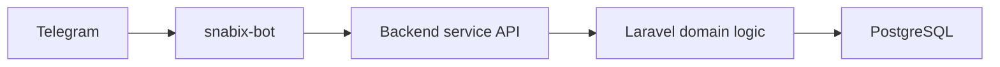

# Архитектура Telegram-бота

`snabix-bot` — отдельный Python-сервис для Telegram. Сейчас бот ориентирован на сервисные и админские сценарии.

## Назначение

Текущие возможности:

- стартовое сообщение;
- меню команд Telegram;
- `/health` для проверки backend;
- `/me` для проверки service identity;
- `/stats` для статистики backend;
- inline-кнопки для обновления и открытия admin panel;
- polling и webhook режимы.

Будущие возможности:

- moderation shortcuts;
- уведомления администраторам;
- привязка Telegram к аккаунту пользователя;
- пользовательские уведомления через Telegram.

## Общая схема



Бот не подключается к базе напрямую. Источник истины — backend.

## Структура

```text
src/snabix_bot/app.py                 запуск polling/webhook
src/snabix_bot/config.py              настройки окружения
src/snabix_bot/clients/backend.py     backend API client
src/snabix_bot/handlers/common.py     /start и /help
src/snabix_bot/handlers/admin.py      admin-команды
src/snabix_bot/handlers/callbacks.py  callback-кнопки
src/snabix_bot/handlers/errors.py     централизованное логирование ошибок
src/snabix_bot/services/access.py     проверка Telegram admin id
src/snabix_bot/services/commands.py   регистрация меню команд
```

## Service API backend-сервиса

Бот вызывает:

- `GET /api/v1/service/bot/health`;
- `GET /api/v1/service/bot/me`;
- `GET /api/v1/service/bot/stats`.

Авторизация:

```http
Authorization: Bearer <SNABIX_BACKEND_SERVICE_TOKEN>
```

Backend middleware:

```text
App\Bot\Infrastructure\Middleware\EnsureBotServiceToken
```

## Доступ администраторов

Сейчас доступ основан на Telegram user id:

```env
SNABIX_ADMIN_TELEGRAM_IDS=123456789,987654321
```

Это достаточно для service MVP. Для пользовательских сценариев нужна будущая привязка аккаунта:

1. Пользователь открывает настройки профиля на сайте.
2. Backend генерирует короткоживущий linking token.
3. Пользователь отправляет token боту.
4. Бот передает token backend.
5. Backend связывает Telegram id с user id.

## Polling

Polling удобен локально:

```env
SNABIX_BOT_MODE=polling
```

Запуск:

```bash
PYTHONPATH=src python -m snabix_bot
```

## Webhook

Webhook нужен для окружений с публичным HTTPS:

```env
SNABIX_BOT_MODE=webhook
SNABIX_BOT_WEBHOOK_URL=https://example.ngrok-free.app/webhook/telegram
SNABIX_BOT_WEBHOOK_PATH=/webhook/telegram
SNABIX_BOT_WEBHOOK_SECRET=long-random-secret
SNABIX_BOT_HOST=0.0.0.0
SNABIX_BOT_PORT=9000
```

Telegram отправляет секрет в заголовке:

```text
X-Telegram-Bot-Api-Secret-Token
```

## Правила развития

- Не добавлять бизнес-правила модерации в bot.
- Все действия с объявлениями должны идти через backend API.
- Не хранить пользовательские данные локально в bot.
- Не логировать токены.
- Любой новый admin action должен иметь backend authorization.
